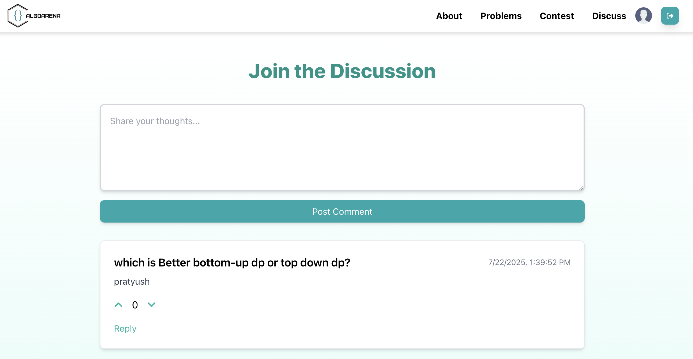

# ⚔️ AlgoArena – A Full-Stack Competitive Programming Platform

**AlgoArena** is a robust, scalable coding platform built to empower students and aspiring developers by offering an end-to-end problem-solving environment. Developed using **Next.js**, **TypeScript**, **Tailwind CSS**, and **Firebase**, AlgoArena merges clean design with full-stack functionality to deliver a seamless experience for users.

It supports essential features like **secure authentication**, **password management**, and an **interactive discussion forum** — all designed under a carefully architected modular layout. AlgoArena has been **tested and reviewed by over 30 university students**, helping refine both usability and feature flow.


---

## 💡 Platform Overview

AlgoArena is more than just a project—it’s a demonstration of how scalable and maintainable software can be built from the ground up using modern web technologies. The platform consists of:

- 🧩 **Problem Page**  
  A central space where users can browse, view, and attempt challenges. Each problem has dedicated views and is dynamically served using statically generated routes.


- ✍️ **In-browser Code Editor**


  
- 🔐 **Authentication System**  
  Implemented using Firebase Auth, our secure login/register system supports:
  - Strong password validation
  - Real-time form validation and error feedback
  - Secure forgot-password workflows

- 💬 **Discussion Page**  
  A real-time discussion forum where users can exchange ideas, ask doubts, or contribute solutions. This fosters community interaction, mentorship, and peer-to-peer learning.
  


- 📄 **About Page**  
  Designed to communicate the vision, mission, and team behind the project, using clean responsive layouts and Tailwind design patterns.
  


---

## 🧠 System Architecture & Functional DFD

To ensure long-term maintainability and clarity of logic flow, AlgoArena follows a layered component-based architecture. Here is the Level 0 Data Flow Diagram (DFD), explaining how users and admin interact with the core components of the platform:

### 🔎 Level 0 Data Flow Diagram


> This diagram represents user Data flow across modules.

---

## 🧪 Tested by Real Users

AlgoArena has been **tested by over 30 university students** from various institutions. Feedback collected from real usage sessions helped us:

- Improve form validation UX  
- Optimize navigation flows  
- Fix edge cases in authentication and routing  

This iterative feedback process significantly contributed to improving platform stability, especially under multiple usage environments (laptops, mobile, tablet).

---

## 👥 Team Behind AlgoArena

> A collaborative effort combining technical innovation, design thinking, and structured development.


| Name               | Role                            | Contributions                                                                 |
|--------------------|----------------------------------|--------------------------------------------------------------------------------|
| **Pratyush Sharma**  | 🧠 Project Lead & Full-Stack Engineer | Led the technical vision, architected the full platform, developed major features (auth, layout, routing), and crafted the About and Discussion page. |
| **Somil Kumar**      | 🎨 UI/UX Designer                  | Created visually engaging layouts, designed the user interface with accessibility and responsiveness in mind. |
| **Dilpreet Singh**   | 🧩 Systems Architect & Diagram Designer | Collaborated in shaping the core architecture and produced accurate system diagrams and flowcharts. |
| **Ruhani Grover**    | 📚 Documentation & QA             | Authored comprehensive documentation and ensured clarity and usability across modules via structured testing. |

---

## 🚀 Getting Started Locally

To clone and run the project locally:

```bash
git clone https://github.com/Pratyushs411/AlgoArena.git
cd AlgoArena
cd algoarena
npm install
npm run dev
